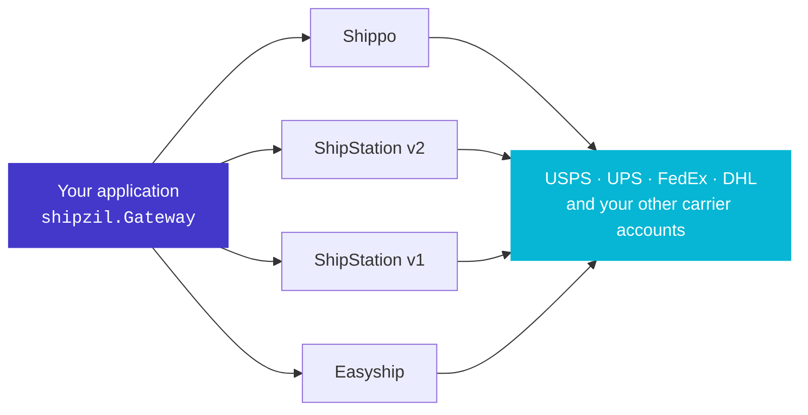

<div align="center">


# shipzil

### OpenRouter for Shipping

**One Python interface across Shippo, ShipStation and Easyship.**<br />
Bring your own provider accounts. Keep your contracts and negotiated rates.

[](LICENSE)
[](https://www.python.org/downloads/)
[](#install)
[](#install)

</div>

---



One request model in. One rate model out. Each rate remembers which of **your**
accounts produced it, and a purchase goes back through that same account.

<br />

|  | |
|---|---|
| **Free, and stays free** | MIT licensed. No shipzil account, no proxy, no per-label fee, no paid tier. Commercial use included. |
| **No vendor lock-in** | Provider details stay at the adapter boundary. Adding a second provider is configuration, not a rewrite. |
| **Leave ShipStation without a rewrite** | ShipStation v1 and v2 are first-class adapters. Add Shippo or Easyship beside them and move at your own pace. |
| **Built for AI agents** | Machine-readable docs, `AGENTS.md`, and per-page Markdown so coding agents get the contract right. |

<br />

## Rate and buy

```python
import shipzil as z

gateway = z.Gateway(shipstation_v2="...", shippo="shippo_test_...")

quote = gateway.get_rates(shipment, carriers={"usps"})

rate = quote.cheapest
label = gateway.buy(shipment, rate)
```

Both providers are queried concurrently. If one fails, the other still returns
rates and the failure lands in `quote.errors`.

<details>
<summary><strong>Full runnable example</strong> (addresses, parcel, error handling)</summary>

```python
import shipzil as z

gateway = z.Gateway(
    shipstation_v2="...",
    shippo="shippo_test_...",
)

shipment = z.Shipment(
    z.Address(
        street1="215 Clayton St",
        city="San Francisco",
        state="CA",
        postal_code="94117",
    ),
    z.Address(
        street1="1600 Pennsylvania Ave NW",
        city="Washington",
        state="DC",
        postal_code="20500",
    ),
    (
        z.Parcel(
            weight=z.Weight.of(16, "oz"),
            dimensions=z.Dimensions.of(10, 8, 4, "in"),
        ),
    ),
)

quote = gateway.get_rates(shipment, carriers={"usps"})

if quote.errors:
    log.warning("some sources failed: %s", quote.errors)

rate = quote.cheapest
if rate is None:
    # No rates, or rates use mixed/unknown currencies.
    raise NoShippingOption(quote.explain())

label = gateway.buy(shipment, rate)
```

</details>

## Built for AI agents

Coding agents guess provider semantics badly, so the docs are published in forms
an agent can consume directly. `make docs-build` produces:

| Surface | Path | Contents |
|---|---|---|
| Index | `/llms.txt` | every page, one line each, for retrieval |
| Full corpus | `/llms-full.txt` | the complete documentation as one file |
| Per page | `/llms.mdx/docs/<page>/content.md` | raw Markdown for a single page |
| Repo guide | [`AGENTS.md`](AGENTS.md) | scope, invariants and verification rules for agents working in this repo |

Every docs page also has **Copy Markdown** and **Open** actions for pasting a
single page into a model context.

The invariants an agent most often gets wrong are stated explicitly: a purchase is
never retried or redirected, FANOUT rates cannot be bought as one label, and
provider service keys are not interchangeable.

---

## Provider support

| Adapter | Multi-parcel rating | Purchase | Cancel / refund | Verification held in this repo |
|---|---|---|---|---|
| Shippo | per-parcel FANOUT | yes | refund request | rating, test purchase and refund run live |
| Easyship | per-parcel FANOUT | yes | cancellation | captured sandbox responses and payload tests |
| ShipStation v1 | per-parcel FANOUT | yes, base64 label | void | captured rating and `testLabel` responses |
| ShipStation v2 | native `packages[]` | yes | void | rating run live; purchase not run live |

FANOUT rates are sums of separate per-parcel quotes. They are marked
`Strategy.FANOUT` and cannot be bought as a single label. The Shippo adapter uses
FANOUT even though Shippo supports native multi-piece rating for some carrier and
account combinations.

## Result model

```python
len(quote)          # number of rates
for rate in quote:  # rates in configured-source order
quote.errors        # source-level failures
quote.excluded      # local filtering and provider-reported exclusions
quote.messages      # provider warning messages
quote.cheapest      # lowest amount, only when currency is known and uniform
quote.fastest       # lowest reported delivery_days
quote.explain()     # human-readable diagnostics
```

Every `Rate` carries `source` (your account name), `provider`, `service_key` and
`currency`, which may be `None` on ShipStation v1.

## Current boundaries

- No provider health scoring or automatic routing. `fallback=(...)` is an order
  you choose.
- Service keys stay provider-scoped. Matching names do not prove equivalent
  delivery behavior.
- Purchases are never retried or redirected. `AmbiguousPurchaseError` means the
  request may have succeeded; reconcile with the provider first.
- `cheapest` returns `None` for mixed or unknown currencies. shipzil does not
  convert money.
- Cross-border rating stops when any item lacks weight or value. EEI data is sent
  only through the Shippo adapter.

See [Concepts](https://sameerkumar18.github.io/shipzil/docs/concepts/) and
[Errors](https://sameerkumar18.github.io/shipzil/docs/errors/) for full behavior.

## Install

```bash
uv add git+https://github.com/sameerkumar18/shipzil.git
```

```bash
pip install git+https://github.com/sameerkumar18/shipzil.git
```

Nothing else is pulled in. `pip list` shows only `shipzil`.

Pin a commit or tag when you want a fixed version:

```bash
uv add git+https://github.com/sameerkumar18/shipzil.git@<commit-or-tag>
```

Or work from a clone:

```bash
git clone https://github.com/sameerkumar18/shipzil.git
cd shipzil
uv sync
uv run python examples/gateway.py
```

> **Alpha.** The API can still change between commits.

## Development

```bash
make check           # lint, types and offline tests
make check-compat    # Python 3.10 through 3.14, live tests excluded
make test-live       # loads credentials from .env and calls real providers
make docs-build      # static docs and generated Python reference
```

## Documentation

[Quickstart](https://sameerkumar18.github.io/shipzil/docs/quickstart/) ·
[Concepts](https://sameerkumar18.github.io/shipzil/docs/concepts/) ·
[Providers](https://sameerkumar18.github.io/shipzil/docs/providers/) ·
[International](https://sameerkumar18.github.io/shipzil/docs/international/) ·
[Errors](https://sameerkumar18.github.io/shipzil/docs/errors/) ·
[Reference](https://sameerkumar18.github.io/shipzil/docs/reference/)

## License

MIT. Commercial use, modification and distribution are allowed under the terms in
[LICENSE](LICENSE).

<sub>"OpenRouter for Shipping" describes the product category. shipzil is not
affiliated with OpenRouter.</sub>
